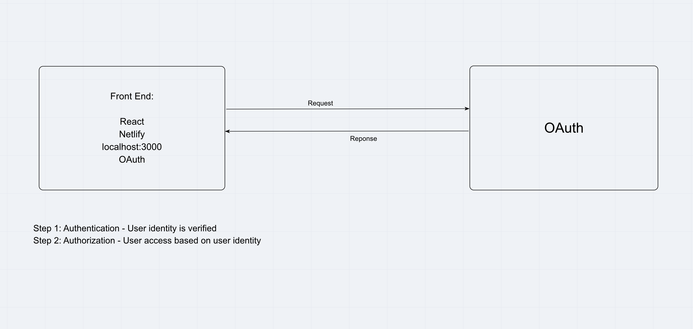

# Best Books!

**Author**: Jessi Velazquez Jakob Lumpkin
**Version**: 1.3.0 (increment the patch/fix version number if you make more commits past your first submission)

## Overview
<!-- Provide a high level overview of what this application is and why you are building it, beyond the fact that it's an assignment for this class. (i.e. What's your problem domain?) -->
This is an application that allows a user to login using their Google credentials and can see a library of favorite books they have saved to their account.

## Getting Started
<!-- What are the steps that a user must take in order to build this app on their own machine and get it running? -->
1. Clone repository from GitHub

## Architecture
<!-- Provide a detailed description of the application design. What technologies (languages, libraries, etc) you're using, and any other relevant design information. -->

## Change Log
<!-- Use this area to document the iterative changes made to your application as each feature is successfully implemented. Use time stamps. Here's an example:

01-01-2001 4:59pm - Application now has a fully-functional express server, with a GET route for the location resource. -->
03-29-2021 10:13 - Site has basic structure and login functionality using Google credentials. Site is deployed to Netlify at [Best Books!](https://thirsty-jones-456a75.netlify.app/)

03-30-2021 9:04pm - Appplication now has sign in ability with favorite books displayed on user account.

03-31-2021 9:04pm - Appplication now has ability save favorite books on user account, add new books, and delete existing books.

## Credit and Collaborations
<!-- Give credit (and a link) to other people or resources that helped you build this application. -->
[https://reactrouter.com/web/api/BrowserRouter](https://reactrouter.com/web/api/BrowserRouter)

**Feature Timing**

Name of feature: User Authentication with OAuth

Estimate of time needed to complete: 5 hours

Start time: 1:00pm

Finish time: 7:00pm

Actual time needed to complete: 6 hours

Name of feature: Added Best Books

Estimate of time needed to complete: 4 hours

Start time: 1:00pm

Finish time: 7:00pm

Actual time needed to complete: 6 hours

Name of feature: Add and Remove Books from User Account

Estimate of time needed to complete: 5 hours

Start time: 3:30pm

Finish time: 9:00pm

Actual time needed to complete: 5.5 hours